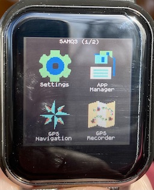
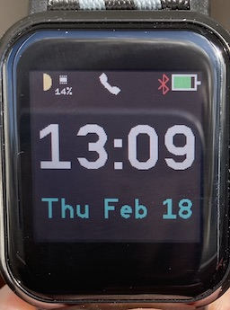
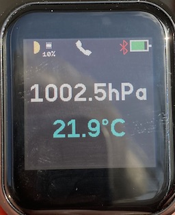
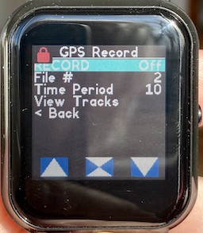
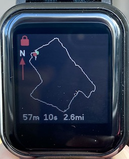

# SMAQ3 Apps Loader (and Apps)

This is an experimental App loader for the SMAQ3 smartwatch - cloned from the Bangle.js App Loader. There is also a set of Espruino apps adapted to run on the SMAQ3.

Access the Loader [here](https://jeffmer.github.io/Q3Apps/).

## Some changes to the Bangle runtime environment

There are a few changes to the Bangle.js runtime environment that the Apps require to run properly. These changes are supported by the firmware included in this repository.

## event bangle.swipe =>

### Call type:
```
Bangle.on('swipe', function(direction) { ... });
```
### Parameters
```
direction - -1 for left, 1 for right, -2 for up, 2 for down.
```

## event E.touch =>

### Call type:
```
E.on('touch', function(coordinates) { ... });
```
### Parameters
```
coordinates - {x:...,y:....} 
```
This event happens after finger is lifted so it is more like a click than a  touch. 
*This should probably be a Bangle rather than an E event - under review*

## Buttons

There is only one button = ```BTN1```.

The simulated buttons in the official Espruino repository for the SMAQ3 are not supported.

## Screenshots
Some pictures of apps running on the SMAQ3:



Launcher App



Multilock App -  Clock face



Multilock App -  BMP280 face



GPS Recorder App -  Menu



GPS Recorder App -  Track display

Note that the red padlock icon means that the screen is locked i.e. touch disabled. On the Bangle this would be display off, however, with an always on display, we simply disable touch to save power. Enabling is controlled by the usual LCD Power On settings e.g. button press.


